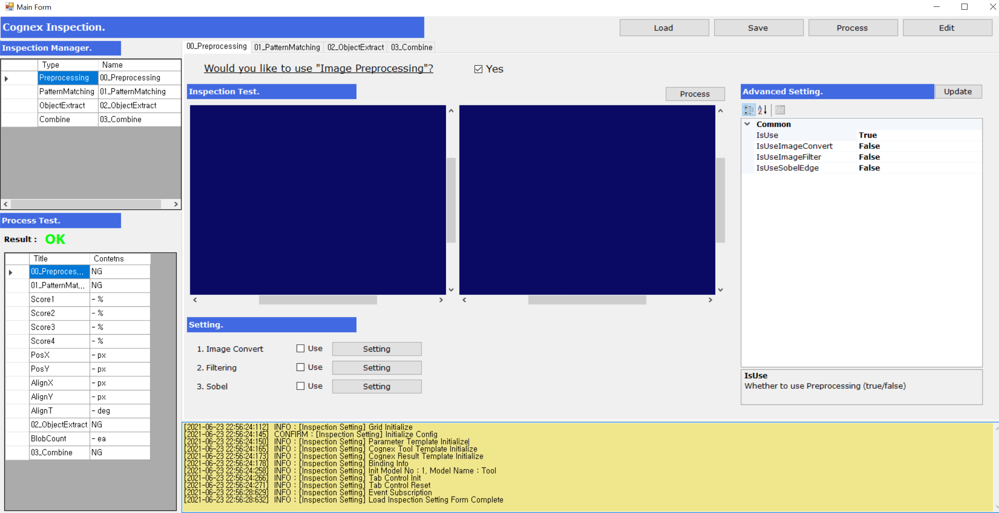
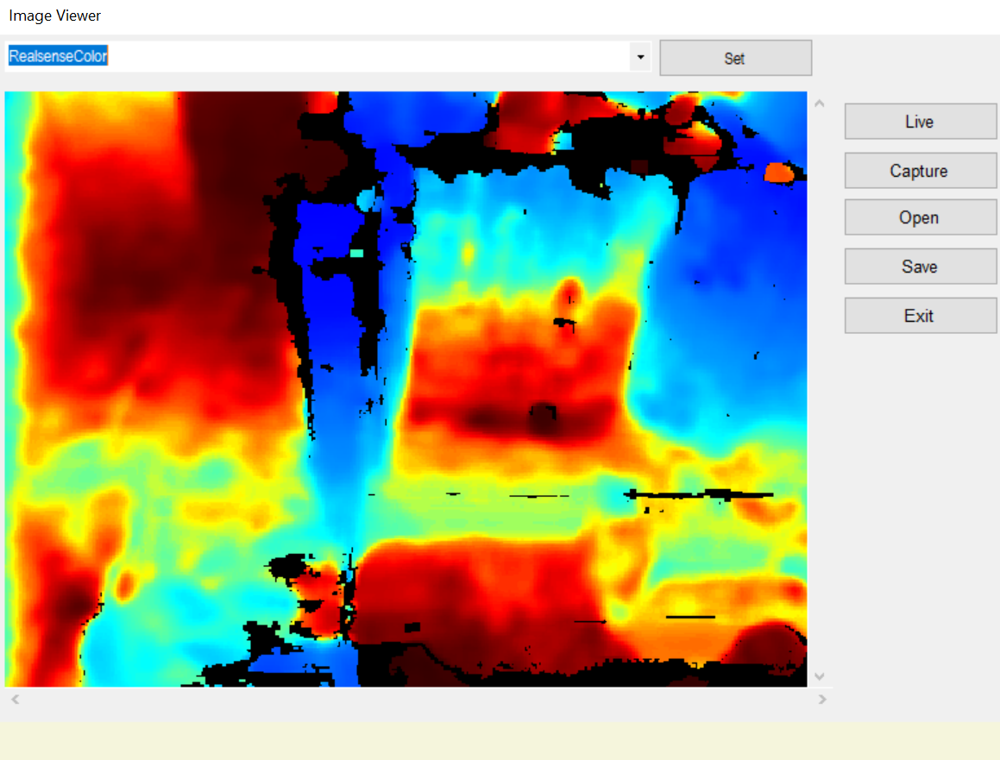
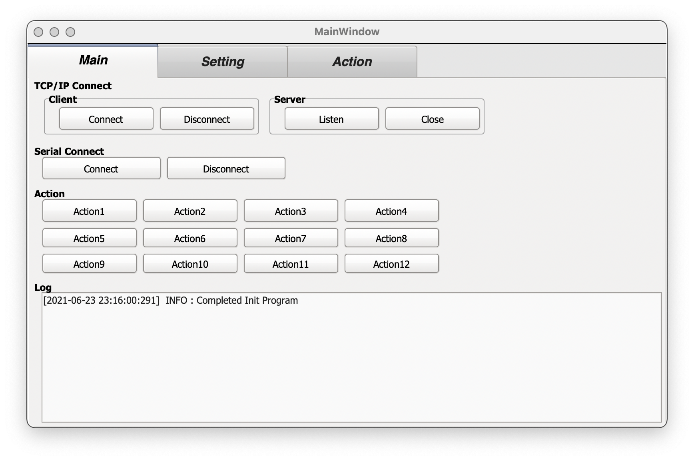
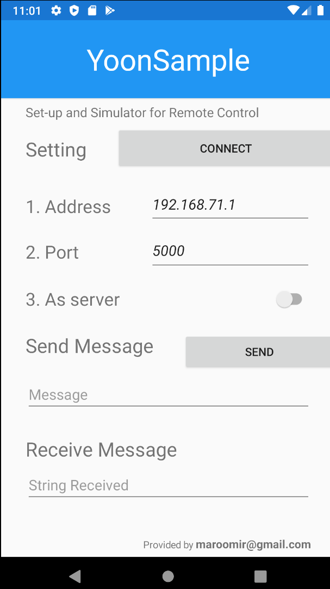

# YoonFactory #

Module에 대한 소개 Page는 [다음](https://github.com/maroomir/YoonFactory/blob/main/README.md)으로 이동했습니다.


YoonFactory는 제조 장비용 Machine Vision Software의 기능들을 Module화 시킨 C# 기반 DLL Library 입니다.

Windows 기반의 Machine Vision Software를 쉽고 빠르게 개발해보려는 목적으로 위 Library들을 설계했습니다.

[개발자](https://github.com/maroomir/)가 7년간 제조 장비 및 Robot 업체에서 개발하며 쌓은 경험과 개인적으로 공부한 지식을 토대로 만들었습니다.

해당 프로젝트는 15개의 DLL 모듈과 4개의 Sample Program으로 이뤄져있습니다.


## Sample Introduction ##

YoonFactory를 활용한 Module들을 소개합니다.

YoonFactory에는 Machine Vision 뿐만 아니라 설비와의 통신, Robot 제어 등을 위한 Module 들이 삽입되어있습니다.

예를 들자면 아래와 같은 기능들이 YoonFactory의 Module만을 간단하게 사용한 Sample로서 기본 탑재되었습니다.


```
- YoonComm을 통해 로봇 또는 장비와 통신 연결, 산업용 Camera 및 3D Camera를 통한 Image Grab을 간편하게 할 수 있습니다.

- YoonImage와 이를 상속하는 Class를 통해 자체 알고리즘 및 OpenCV를 활용한 Machine Vision 뿐만 아니라 상용 라이브러리(Cognex) 또한 사용할 수 있습니다.

- YoonMono을 통해 Linux, Mac, Android, iOS 환경에서 구동 가능한 외부 설비간의 통신용 Module Program을 만들 수 있습니다.

```

이 Project에 포함되어있는 YoonSample들은 YoonFactory의 Module의 기능 개선을 위한 Debugging 뿐만 아니라 활용성을 소개하기 위한 목적으로 만들었습니다.

아래 4개 Sample들은 간단한 Toy Program 이며, YoonFactory를 사용해 대형 Program을 만드는 작업은 현재 기획 중입니다.


### CognexInspection ###




### ImageViewer ###



### YoonMono ###



### YoonXamarin ###




